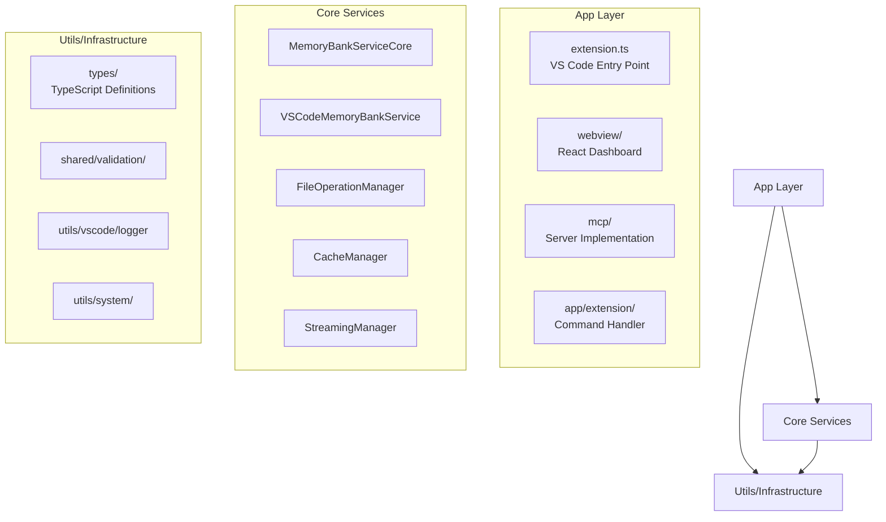

# System Architecture

> Real architecture implementation for AI Memory Extension

## 🏗 High-Level Architecture

### **Clean Architecture Layers**



### **Dependency Flow**

- **App Layer**: Entry points and user interfaces
- **Core Services**: Business logic and data management
- **Utils/Infrastructure**: Cross-cutting concerns and utilities
- **No Upward Dependencies**: Clean separation enforced

## 🔧 Core Services Architecture

### **Memory Bank Service Core** (`MemoryBankServiceCore`)

```typescript
// Primary business logic service
class MemoryBankServiceCore implements MemoryBank {
  // Dependencies injected via constructor
  constructor(
    memoryBankPath: string,
    logger: MemoryBankLogger,
    cacheManager: CacheManager,
    streamingManager: StreamingManager,
    fileOperationManager: FileOperationManager
  )

  // Core operations
  async getIsMemoryBankInitialized(): AsyncResult<boolean, MemoryBankError>
  async loadFiles(): AsyncResult<MemoryBankFileType[], MemoryBankError>
  async updateFile(type: MemoryBankFileType, content: string): AsyncResult<void, MemoryBankError>
  async checkHealth(): AsyncResult<string, MemoryBankError>
}
```

**Key Patterns**:

- **Result Pattern**: All operations return `AsyncResult<T, Error>` for explicit error handling
- **Dependency Injection**: Constructor injection for testability
- **Adapter Integration**: Legacy adapters for performance layer compatibility
- **State Management**: Internal file cache with invalidation

### **File Operation Manager** (`FileOperationManager`)

```typescript
// Low-level file operations with retry logic
class FileOperationManager {
  async readFile(filePath: string): Promise<FileResult<string>>
  async writeFile(filePath: string, content: string): Promise<FileResult<void>>
  async mkdirWithRetry(dirPath: string, options?): Promise<FileResult<void>>
  async stat(filePath: string): Promise<FileResult<Stats>>
}
```

**Key Features**:

- **Retry Logic**: Exponential backoff for transient failures
- **Path Validation**: Security boundary enforcement
- **Error Wrapping**: Consistent error types across operations
- **Performance Monitoring**: Operation timing and statistics

### **Cache Manager** (`CacheManager`)

```typescript
// LRU cache with performance monitoring
class CacheManager {
  get<T>(key: string): T | undefined
  set<T>(key: string, value: T): void
  invalidate(key?: string): void
  getStats(): CacheStats
}
```

**Implementation**:

- **LRU Strategy**: Automatic eviction of least recently used items
- **Memory Bounds**: Configurable size limits
- **Statistics**: Hit/miss ratios, eviction tracking
- **Type Safety**: Generic type support with proper TypeScript

## 🔌 Integration Patterns

### **MCP Server Architecture**

```typescript
// STDIO-based MCP server with child process management
class MemoryBankMCPAdapter implements MCPServerInterface {
  private childProcess: ChildProcess | null = null

  async start(): Promise<void> {
    this.childProcess = await launchMCPServerProcess(...)
  }

  // Tool implementations delegate to core services
  async updateMemoryBankFile(fileType: string, content: string): Promise<void>
  async handleCommand(command: string, args: string[]): Promise<string>
}
```

**MCP Tools Implemented**:

1. `initialize-memory-bank` - Create folder structure and templates
2. `list-memory-bank-files` - List all available files with metadata
3. `read-memory-bank-files` - Bulk read operation for context loading
4. `read-memory-bank-file` - Single file read operation
5. `update-memory-bank-file` - Safe file update with validation
6. `health-check-memory-bank` - System health and integrity checks

### **VS Code Extension Integration**

```typescript
// Extension lifecycle and command registration
export function activate(context: vscode.ExtensionContext) {
  // 1. Initialize DI container
  const container = new DIContainer()
  registerCoreServices(container, logger, context)

  // 2. Register commands
  registerCommands(context, container, ...)

  // 3. Setup configuration listeners
  setupConfigurationListeners(context, container)
}
```

**Commands Registered**:

- `aimemory.startMCP` - Initialize and start MCP server
- `aimemory.openWebview` - Launch React dashboard
- `aimemory.updateMCPConfig` - Update Cursor configuration
- `aimemory.stopServer` - Stop MCP server
- `aimemory.showOutput` - Open extension logs
- `aimemory.setLogLevel` - Configure logging verbosity

## 🎨 Frontend Architecture

### **React Webview Implementation**

- **Framework**: React 19 with concurrent features
- **Styling**: Tailwind CSS 4 with native Vite integration
- **Components**: VS Code Elements for native theming
- **State**: Local state with message passing to extension
- **Build**: Vite 6 with hot module replacement

### **Webview Manager** (`webviewManager.ts`)

```typescript
// Manages webview lifecycle and communication
class WebviewManager {
  async openWebview(): Promise<void>
  private createWebviewContent(): string
  private setupMessageHandling(webview: vscode.Webview): void
}
```

**Communication Pattern**:

- **PostMessage**: Structured communication between extension and webview
- **Message Types**: Status updates, commands, error reporting
- **CSP**: Strict Content Security Policy for security
- **Asset Handling**: Proper resource URIs for webview context

## 🛡 Security Architecture

### **Input Validation Layer**

```typescript
// Zod schemas for runtime validation
const memoryBankFileSchema = z.object({
  type: z.enum(MEMORY_BANK_FILE_TYPES),
  content: z.string().min(1),
  metadata: z.object({...})
})
```

**Validation Patterns**:

- **Schema-First**: Zod schemas define all input interfaces
- **Runtime Checks**: All user inputs validated at boundaries
- **Type Safety**: Schema types automatically inferred
- **Error Messages**: User-friendly validation error reporting

### **Path Security**

```typescript
// Path traversal prevention
function validateAndConstructArbitraryFilePath(
  basePath: string,
  relativePath: string
): Result<string, SecurityError>
```

**Security Measures**:

- **Boundary Enforcement**: All file operations within workspace
- **Path Normalization**: Resolve .. and . path components
- **Whitelist Validation**: Only allowed file extensions and names
- **Error Logging**: Security violations logged for monitoring

## ⚡ Performance Architecture

### **Streaming Operations**

```typescript
// Intelligent file handling based on size
class StreamingManager {
  async readFile(filePath: string): Promise<FileContent>
  private shouldUseStreaming(filePath: string): boolean
  private createReadStream(filePath: string): NodeJS.ReadableStream
}
```

**Performance Strategies**:

- **Size-Based Routing**: <30KB normal read, >30KB streaming
- **Memory Pressure**: Monitoring and adaptive behavior
- **Cache Integration**: Intelligent caching of frequently accessed files
- **Metrics Collection**: Performance statistics for optimization

### **Adapter Pattern for Legacy Integration**

```typescript
// Bridge between new and legacy performance systems
class LegacyCacheAdapter {
  constructor(private modernCache: CacheManager) {}

  // Implement legacy interface using modern cache
  get(key: string): any { return this.modernCache.get(key) }
  set(key: string, value: any): void { this.modernCache.set(key, value) }
}
```

## 🔄 Build Architecture

### **Multi-Target Build System**

- **Extension**: Rollup → CommonJS for VS Code compatibility
- **MCP Server**: Rollup → CommonJS for Node.js CLI execution
- **Webview**: Vite → ES modules for modern browser features

### **Development Architecture**

- **Hot Reload**: Webview development with instant updates
- **Watch Mode**: Extension rebuild on source changes
- **Parallel Builds**: Concurrent extension and webview building
- **Type Checking**: Continuous TypeScript validation

---

> Last updated: 6 June 2025
