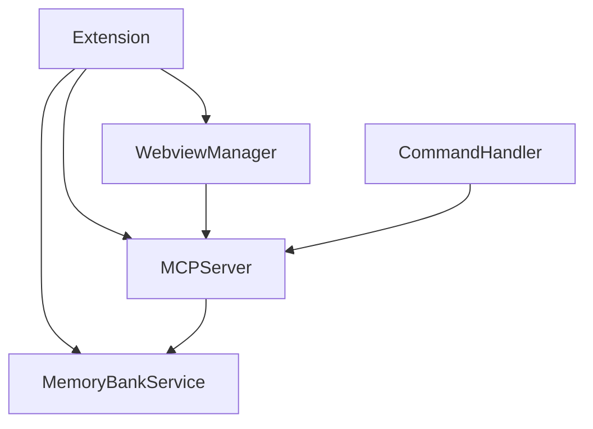

# System Patterns Index

This folder documents the internal, modular, and development-focused system patterns for the AI Memory extension's memory bank. These patterns support robust, context-aware AI workflows in Cursor and VS Code, and guide ongoing development and future enhancements.

## System Architecture & Patterns (Summary)
- Modular memory bank: `core/`, `systemPatterns/`, `techContext/`, `progress/`
- MCP server (CLI/stdio) exposes memory bank as resources/tools
- Webview dashboard for user actions and feedback
- Self-healing logic ensures all required files are present
- Service-oriented, Cursor-first architecture
- Async, robust file operations with readiness checks
- Planner tools and command handler for `/memory` commands

## System Architecture
- Modular memory bank with subfolders: `core/`, `systemPatterns/`, `techContext/`, `progress/`.
- MCP server exposes memory bank as resources and tools, with robust error handling and port failover.
- Webview dashboard for user interaction, including initialisation and updates.
- Service-oriented architecture for extension components (MemoryBankService, MCPServer, CommandHandler, WebviewManager, Extension entry point).
- **MCP server CLI entrypoint for stdio transport implemented for Cursor 0.50+ compatibility (2025-05-11).**

## Key Technical Decisions
- All file operations are async and robust, with readiness checks and error handling.
- Migration logic for flat to modular structure, with user consent.
- Automatic port failover for MCP server.
- Cursor-first compatibility, with VS Code as a bonus.
- Public documentation in `docs/`, private memory in `memory-bank/`.
- Use of Git Flow for release management.
- **CLI-based MCP server and JSON-RPC 2.0 compliance now standard.**

## Design Patterns in Use
- Service-oriented architecture for extension components.
- Command handler for `/memory` commands.
- Separation of concerns between backend, MCP server, and webview.
- Planner tools for extracting and updating project plans (see `EXPERIMENTAL-MCP-PLAN.md`).
- **CLI/stdio transport pattern for MCP server, replacing legacy HTTP/SSE for Cursor 0.50+.**

## Component Relationships

_Last updated: 2025-05-18_
